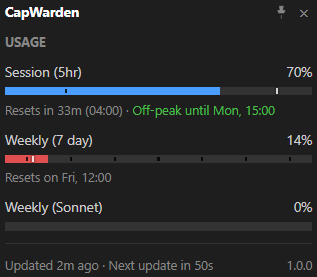

# Note: Open-source release coming here soon. For now, this repository provides the project overview.

# CapWarden

A free Windows system tray monitor for Claude rate limits.

CapWarden sits in your system tray and shows your Claude usage at a glance. Color-coded icon, live usage bars, reset countdowns, and peak hours tracking — so you always know where you stand before starting a conversation. Authenticates via your existing Claude Code login.

## Why CapWarden?

- **Glanceable:** Tray icon changes color based on your usage state — green (tokens available), amber (peak hours), red (quota exhausted). No need to open anything
- **Transparent:** Handles your OAuth token with care. Credentials isolated in a single module, sole network destination is `api.anthropic.com`, no telemetry, no file writes, no `eval`/`exec`, no obfuscation. Four well-known dependencies. [Source on GitHub](https://github.com/yevgeniyglider/CapWarden) — easy to audit
- **Detailed when you need it:** Click for a popup with all active quota types, usage bars with time markers, reset countdowns, and peak/off-peak status
- **Zero configuration:** Download, install, run. Works out of the box if you have Claude Code installed. Optional JSON settings file for power users

## How It Works

1. Install CapWarden and make sure [Claude Code](https://docs.anthropic.com/en/docs/claude-code/overview) is installed and logged in (CLI, VS Code, JetBrains, Cursor, or Windsurf — any will work)
2. Launch CapWarden — it appears in your system tray and starts polling your usage
3. Glance at the tray icon color for a quick read, or click it for the full detail popup
4. Get notified when you're approaching a threshold, or when a quota resets

Under the hood — no telemetry or data collection, the only network traffic is polling your usage from Anthropic's API:

- Adaptive polling (3-10 min base interval): speeds up during active use, pauses on idle/lock, backs off on errors
- Peak hours detection with a built-in visual schedule editor
- Smart alerts with configurable thresholds per quota type and time-aware mode
- Event commands: trigger shell commands on quota reset or threshold crossing
- Automatic OAuth token refresh via Claude Code CLI



## Quick Start

Download the Windows installer from [yevgeniyglider.com/capwarden](https://yevgeniyglider.com/capwarden/) and run it. No Python required.

## Installation from Source

Requires Python 3.10+ on Windows.

```bash
python -m venv .venv
.venv\Scripts\activate
pip install -r requirements.txt
```

Run with `python -m cap_warden`. Tests: `python -m unittest discover -s tests`.

To build the EXE: `python build.py` (produces `dist/CapWarden.exe`).

## Architecture

CapWarden is a Python application with a system tray interface:

- **Tray icon:** [pystray](https://github.com/moses-palmer/pystray) with dynamically rendered Pillow icons
- **Detail popup:** [pywebview](https://pywebview.flowrl.com/) with HTML/CSS/JS UI (WinForms host, Edge WebView2)
- **API:** OAuth token refresh via Claude Code CLI, polling against `api.anthropic.com`
- **Packaging:** PyInstaller onedir build; Inno Setup for the Windows installer

The codebase is a single Python package (`cap_warden/`) with 16 focused modules plus HTML/CSS/JS popup assets. 15 test modules cover the core logic.

## Acknowledgments

- [Usage Monitor for Claude](https://github.com/jens-duttke/usage-monitor-for-claude) by Jens Duttke for the original concept and codebase
- [pystray](https://github.com/moses-palmer/pystray) for cross-platform system tray support
- [pywebview](https://pywebview.flowrl.com/) for the native popup windows

## License

MIT License. See [LICENSE](LICENSE) for the full text.

Derived from [Usage Monitor for Claude](https://github.com/jens-duttke/usage-monitor-for-claude) by Jens Duttke (MIT). See [NOTICE](NOTICE) for the original copyright. Third-party dependency licenses are in [THIRD-PARTY-LICENSES.md](THIRD-PARTY-LICENSES.md).

This is an independent project, not created or endorsed by [Anthropic](https://www.anthropic.com/).

---

[yevgeniyglider.com/capwarden](https://yevgeniyglider.com/capwarden/) · Built by [Yevgeniy Glider](https://yevgeniyglider.com)
